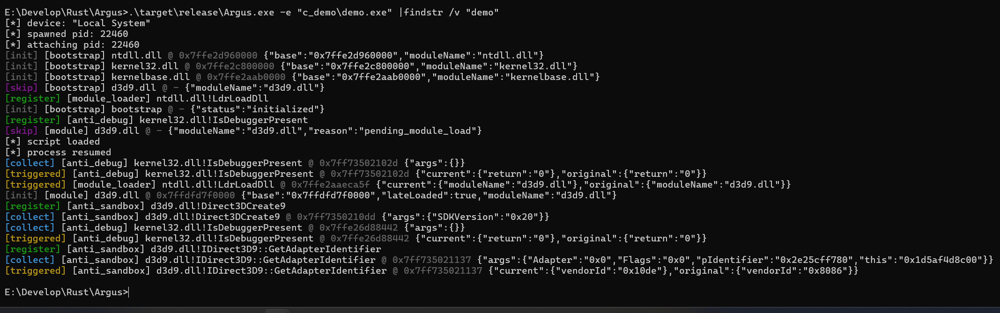

<table>
  <tr>
    <td width="280">
      
    </td>
    <td>
      <h1>Argus</h1>
      <p>
        <i>Argus Panoptes</i>, the many-eyed watcher from Greek mythology.
      </p>
      <p>
        Dynamic behavior observation tool based on Frida.
      </p>
      <p>
        
        
        
        
      </p>
    </td>
  </tr>
</table>

## Overview

Argus is a Windows dynamic behavior observation tool built on top of [Frida](https://frida.re/). It launches or attaches to a target process, injects a JavaScript runtime, loads rule scripts, and streams structured events back to Rust for console or JSONL output.

The project is currently focused on anti-analysis observation and patching experiments, including anti-debugging, anti-sandbox, VM checks, module loading, and API return-value normalization.

## Preview

<p>
  
</p>

## Features

- Spawn a target process and attach before resume.
- Attach to an existing process by PID.
- Load an embedded `bootstrap.js` runtime.
- Load external rule scripts from the `scripts` rule repository.
- Emit structured Frida events with a stable `argus.frida.v1` schema.
- Support console and JSONL output modes.
- Save output to a file while optionally hiding console output.

## Rules

Rule scripts live in a separate repository and are referenced as a Git submodule:

```text
scripts -> https://github.com/UNSAFE-TEAM/Argus-Rules.git
```

Clone with submodules:

```powershell
git clone --recurse-submodules https://github.com/UNSAFE-TEAM/Argus.git
```

If the repository was already cloned:

```powershell
git submodule update --init --recursive
```

Update rules:

```powershell
cd scripts
git pull origin main
cd ..
git add scripts
git commit -m "chore: update rules"
```

## Usage

Run a program:

```powershell
Argus.exe --exec ".\target.exe --flag value"
```

Attach to a PID:

```powershell
Argus.exe --pid 1234
```

Use JSONL output:

```powershell
Argus.exe --exec ".\target.exe" --output jsonl
```

Save output to a file:

```powershell
Argus.exe --exec ".\target.exe" --save argus.log
```

Save output without printing Argus events to the console:

```powershell
Argus.exe --exec ".\target.exe" --quiet --save argus.log
```

## Event Format

Rules send events through the bootstrap runtime. The Rust side receives and formats events like:

```json
{
  "schema": "argus.frida.v1",
  "time": "2026-05-27T07:13:12.609Z",
  "event": "triggered",
  "tag": "anti_debug",
  "subject": {
    "name": "kernel32.dll!IsDebuggerPresent",
    "address": "0x7ff7de79102d"
  },
  "data": {
    "original": {
      "return": "1"
    },
    "current": {
      "return": "0"
    }
  }
}
```

Common event types:

| Event | Purpose |
| --- | --- |
| `init` | Runtime or module initialization. |
| `register` | A hook has been installed. |
| `collect` | API call input was collected. |
| `triggered` | A rule handled or modified behavior. |
| `skip` | A module or API is unavailable. |
| `error` | Script/runtime error reporting. |

For `collect` and `triggered`, `subject.address` is the caller return address.
This makes the output easier to map back into IDA, x64dbg, or other debuggers.

## Output Modes

Console output is intended for live reading:

```text
[triggered] [anti_debug] kernel32.dll!IsDebuggerPresent @ 0x7ff7de79102d {"current":{"return":"0"},"original":{"return":"1"}}
```

JSONL output is intended for tools, storage, and later UI rendering:

```text
{"schema":"argus.frida.v1","time":"...","event":"collect","tag":"anti_debug","subject":{"name":"kernel32.dll!IsDebuggerPresent","address":"0x..."},"data":{"args":{}}}
```

## Build

Build in debug mode:

```powershell
cargo build
```

Build in release mode:

```powershell
cargo build --release
```

The Frida Rust bindings may download the matching Frida core devkit during build. If the download fails behind a proxy, configure Cargo/Git proxy settings or place the devkit where `frida-sys` can find it.

## Repository Layout

```text
bootstrap.js       Frida runtime embedded by Argus
scripts/           External rule scripts submodule
src/cli/           Command-line parsing
src/frida/         Frida session, spawn, attach, and script loading
src/output/        Event parsing and output formatting
template.js        Rule authoring template
assets/            Project images
```

## Roadmap

- Improve common anti-debugging rules.
- Improve common anti-sandbox and VM detection bypass rules.
- Add shellcode fuzzing experiments.
- Add unpacking and dump workflows.
- Add richer report and UI support based on structured JSON output.

## Status

Argus is an early-stage internal research tool. APIs, event fields, and rule layout may change while the runtime and rule system are being stabilized.
